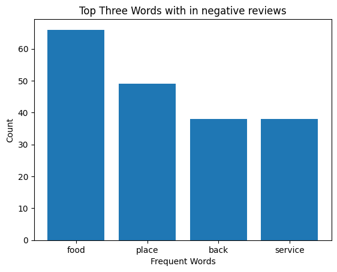

# Sentiment Analysis Flask API

This repository contains the code and resources for a Sentiment Analysis Flask API. The API utilizes a trained machine learning model to predict the sentiment (positive or negative) of user reviews. The model is trained on the "Restaurant_Reviews.tsv" dataset.

## Project Overview

The Sentiment Analysis Flask API is designed to provide a user-friendly interface for predicting the sentiment of user reviews. The API takes advantage of a trained machine learning model to process the user input and generate sentiment predictions.

## Dataset

The "Restaurant_Reviews.tsv" dataset is used for training the sentiment analysis model. It consists of user reviews of restaurants, with corresponding sentiment labels (positive or negative). The dataset is used to train the model to recognize patterns and make accurate sentiment predictions.

## Model Training and Evaluation

The model training and evaluation process are documented in the "NLP_reviews.ipynb" Jupyter Notebook. This notebook provides insights into how the data is processed, various classification algorithms are applied, and the best model is selected based on performance metrics. Additionally, the notebook showcases how the trained model is saved for future use.

## Most Frequent Words from Negative Reviews
To obtain the keywords related to negative reviews, check the script in "NLP_freq_words.ipynb". The notebook provides insights into the most frequent words extracted from the negative reviews of the restaurant dataset. By analyzing the negative sentiments expressed in the reviews, we can gain valuable insights about areas that may require attention or improvement. The top four most frequent words from the negative reviews are: "food," "place," "service," and "back."

### Word Interpretation:

1. **Food**: The frequent mention of "food" in negative reviews suggests that customers have expressed dissatisfaction with the quality, taste, or presentation of the dishes. It indicates the need to focus on enhancing the culinary experience and ensuring that the food meets customers' expectations.

2. **Place**: The word "place" being frequently mentioned in negative reviews signifies that customers have encountered issues related to the overall environment, ambiance, cleanliness, or other aspects of the physical establishment. Addressing these concerns can enhance the overall dining experience and create a more welcoming atmosphere.

3. **Service**: The prominence of the word "service" in negative reviews indicates that customers have expressed dissatisfaction with the level of customer service provided. This could include issues related to wait times, staff behavior, responsiveness, or accuracy of order delivery. Improving service quality and ensuring attentive and friendly staff interactions are crucial for customer satisfaction.

4. **Back**: The frequent mention of the word "back" in negative reviews suggests that customers have expressed hesitation or disappointment in returning to the establishment. This could be due to the negative experiences they encountered during their previous visit. Addressing the underlying issues and providing solutions can help regain customer trust and encourage repeat visits.

### Bar Plot:

The bar plot below illustrates the frequency of occurrence for the top four most frequent words from the negative reviews:

The bar plot visually represents the counts of the words "food," "place," "service," and "back" in the negative reviews. The height of each bar represents the frequency of occurrence of the corresponding word. Analyzing such visualizations can help in understanding the relative importance of these words within the negative reviews.

## Flask API Implementation

The core of the project lies in the "app.py" file, which contains the code for the Sentiment Analysis Flask API. The API is built using the Flask framework, providing routes and endpoints to handle user requests. It utilizes the trained model and a vectorizer to preprocess the user review input and generate sentiment predictions.

## User Interface

The "templates" folder contains an HTML file that serves as the user interface for the Sentiment Analysis Flask API. The HTML file is designed to provide an intuitive and visually pleasing interface for users to interact with the API. Users can enter their review text into an input field and receive sentiment predictions by clicking the "Predict" button.

## Deployment and Requirements

To run the Sentiment Analysis Flask API locally, the required Python packages are listed in the "requirements.txt" file. Users can install the necessary packages using `pip install -r requirements.txt`. Additionally, the "Procfile" is included for deployment purposes, enabling the API to be deployed on platforms like Heroku (more on this soon).

## Blog
Here is my article (in two parts) on Medium explaining the code details. 

https://medium.com/@pritigupta.ds/exploring-sentiment-analysis-using-nlp-a-simple-example-with-restaurant-reviews-78538dfb9f27

https://medium.com/@pritigupta.ds/building-an-api-with-flask-making-sentiment-analysis-accessible-87936cd7609b

## Acknowledgements 
- The dataset is taken from Udemy ML content.
- I would like to acknowledge the usage of ChatGPT for helpful suggestions in correcting the html file.

## Contact
Please get in touch if you struggle to implement this code or let me know if you achieve a better accuracy.
Reach out to me at pritigupta.ds@gmail.com.

