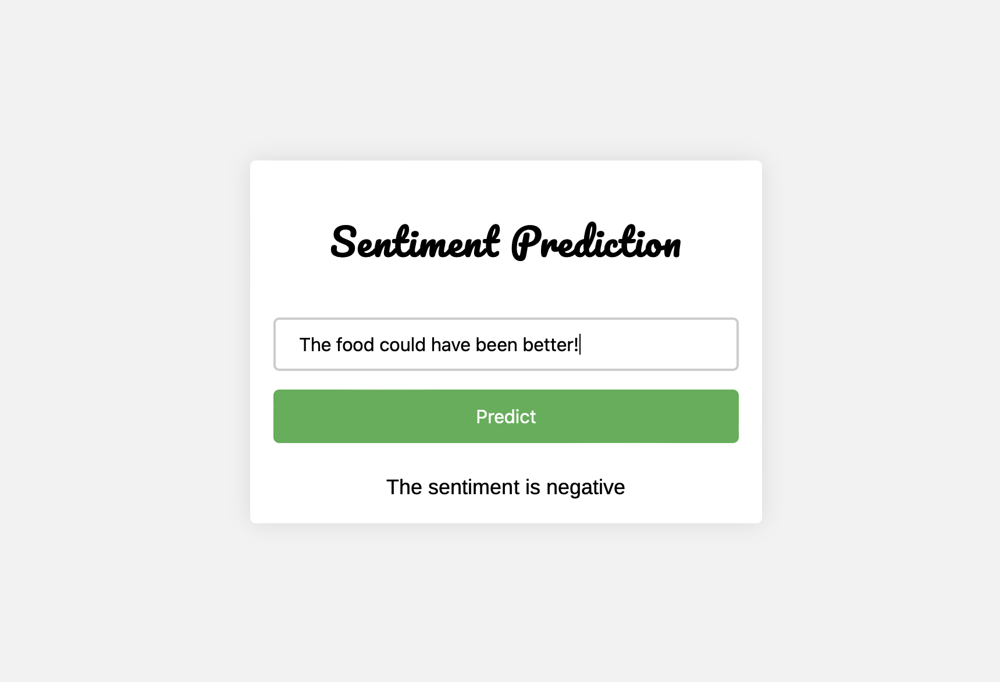

# Sentiment Analysis Flask API

This repository contains the code and resources for a Sentiment Analysis Flask API. The API utilizes a trained machine learning model to predict the sentiment (positive or negative) of user reviews. The model is trained on the "Restaurant_Reviews.tsv" dataset.

## Project Overview

The Sentiment Analysis Flask API is designed to provide a user-friendly interface for predicting the sentiment of user reviews. The API takes advantage of a trained machine learning model to process the user input and generate sentiment predictions.

## Dataset

The "Restaurant_Reviews.tsv" dataset is used for training the sentiment analysis model. It consists of user reviews of restaurants, with corresponding sentiment labels (positive or negative). The dataset is used to train the model to recognize patterns and make accurate sentiment predictions.

## Model Training and Evaluation

The model training and evaluation process are documented in the "NLP_reviews.ipynb" Jupyter Notebook. This notebook provides insights into how the data is processed, various classification algorithms are applied, and the best model is selected based on performance metrics. Additionally, the notebook showcases how the trained model is saved for future use.

## Flask API Implementation

The core of the project lies in the "app.py" file, which contains the code for the Sentiment Analysis Flask API. The API is built using the Flask framework, providing routes and endpoints to handle user requests. It utilizes the trained model and a vectorizer to preprocess the user review input and generate sentiment predictions.

## User Interface

The "templates" folder contains an HTML file that serves as the user interface for the Sentiment Analysis Flask API. The HTML file is designed to provide an intuitive and visually pleasing interface for users to interact with the API. Users can enter their review text into an input field and receive sentiment predictions by clicking the "Predict" button.

## Deployment and Requirements

To run the Sentiment Analysis Flask API locally, the required Python packages are listed in the "requirements.txt" file. Users can install the necessary packages using `pip install -r requirements.txt`. Additionally, the "Procfile" is included for deployment purposes, enabling the API to be deployed on platforms like Heroku (more on this soon).

## Acknowledgements 
- The dataset is taken from Udemy ML content.
- I would like to acknowledge the usage of ChatGPT for helpful suggestions in correcting the html file.

## Contact
Please get in touch if you struggle to implement this code or let me know if you achieve a better accuracy.
Reach out to me at pritigupta.ds@gmail.com.

